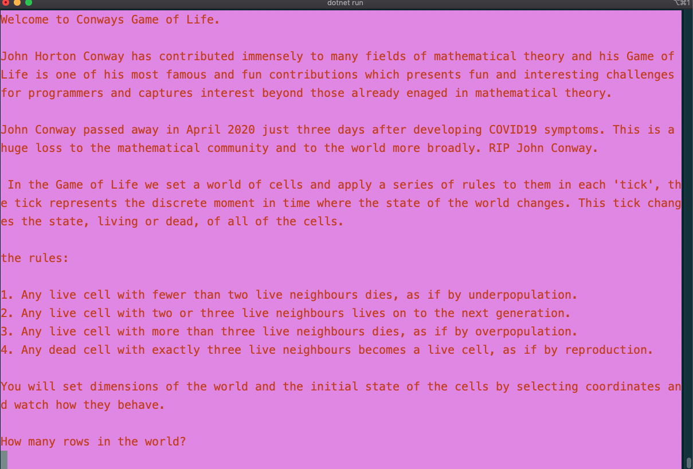
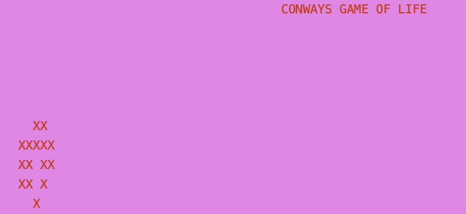
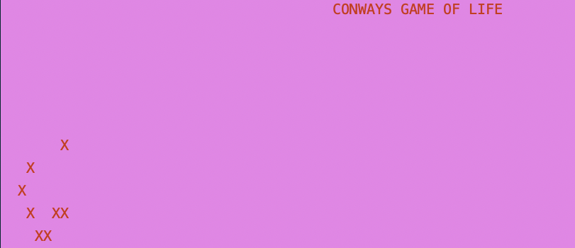

# ConwaysGameOfLife

### Life

This C# console app is my first shot at Conways Game of Life. I've been interested in this problem since studying discrete maths during my diploma of I.T. 

I was very sad to learn recently that John Conway passed away in April 2020 just days after coming down with symptoms of COVID19.

Life is how I know about John Conway's work, and is  certainly his most widely known contribution to maths theory - while this seems to have been be a point of frustration, to become synonymous with one work, it is wondrous to have contributed something to the world of maths and programming theory which is able to engage and excite people who are not already part of those worlds. 

### The Rules

1. Any live cell with fewer than two live neighbours dies, as if by underpopulation.
2. Any live cell with two or three live neighbours lives on to the next generation. 
3.  Any live cell with more than three live neighbours dies, as if by overpopulation. 
4. Any dead cell with exactly three live neighbours becomes a live cell, as if by reproduction. 

### Console Play Through

An introduction and rules.

User sets the dimensions of the world and then 'innoculates' the world with live cells. The user inputs a string of coordinates: eg: "0,0 0,1 0,2", which sets the starting state of the world, then the program begins to 'tick' and print the new state of the world.

### Tick

The tick in Life is the discrete moment where the rules are actioned and the state of the world transforms.

My console app runs an infinite loop wherein it ticks and displays the state of the world. It will do this until the program is terminated.

